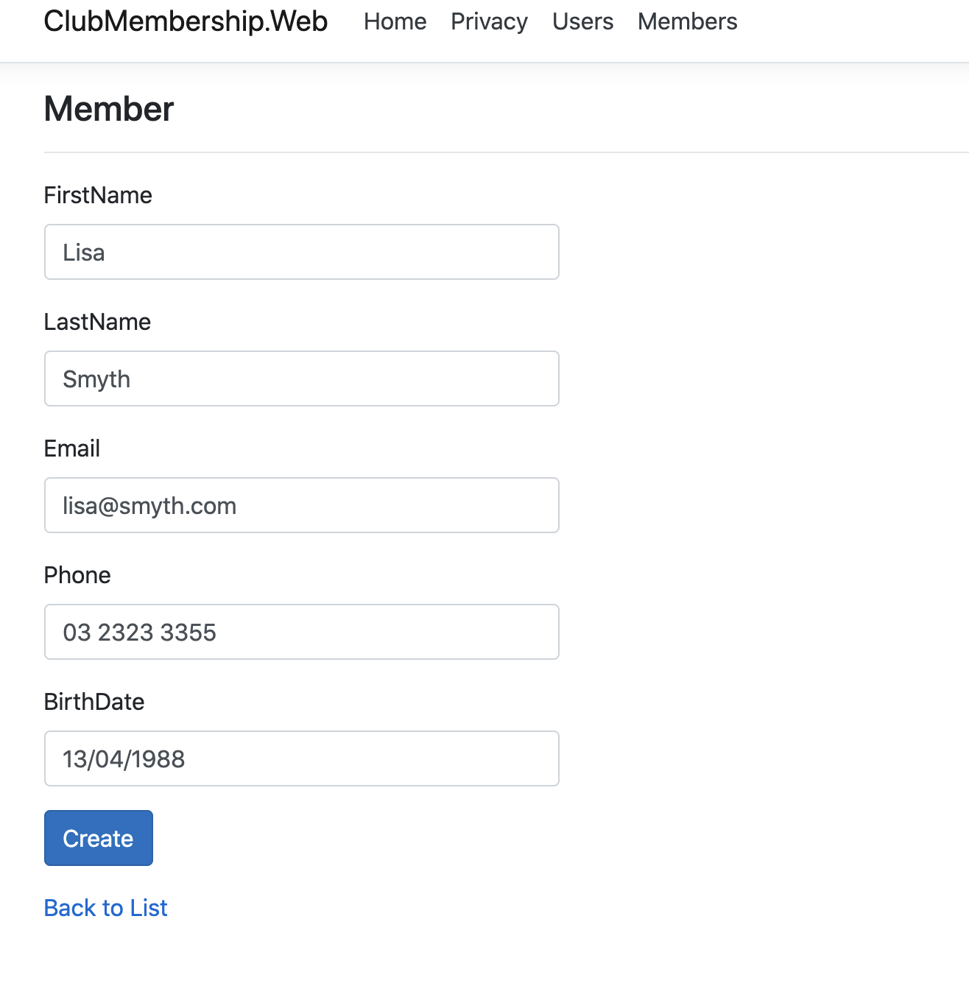

# Club Membership Application

## Assessment Tasks

Validate Software

### PART 3

Now you have implement seldected use cases, its time for you to validate it.

Record your validation details
- Date
- Name
- Procedures
- Results (including screen shots)

1. Validate the software design to ensure the design is complete, accurate and feasible.
   - Include diagrams, class, erd, activity, seq, flow etc...
2. Validate the database structure and elements, including screenshots
3. Validate the UI design
4. Validate the software code for consistency and analysis of the code using 2 static analysis tools (c# and web). Include screen shots

| Date     | Name  | Validate                      | Procedures   |
|----------|-------|-------------------------------|-------------|---|
| 10th May | Elena | Software Design               | Noticed that he design did not show a cancel membership screen, design includes future features such as sign in, change password and some user details   |
| 10th May | Elena |                               |              |
| 10th May | Elena | Database Design               | Noticed that the requirement of having an email address on the member was not included, and so needs to be added             |
| 10th May | Elena | UI Design                     | Was complete             |
| 10th May | Elena | Static Analyses Consistency   | Static code analysis was 100% OK, w3 HTML validator has some minor issues             |

### UX for MVP

**Home Page**

---

**List employees**

---

**List members**

---

**Create member**

---

## StyleCop validation

## W3C Validation

