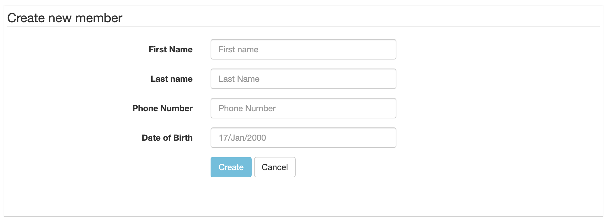
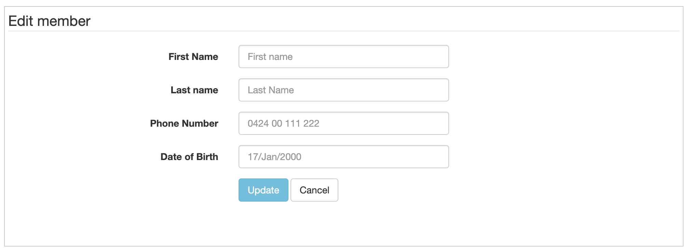
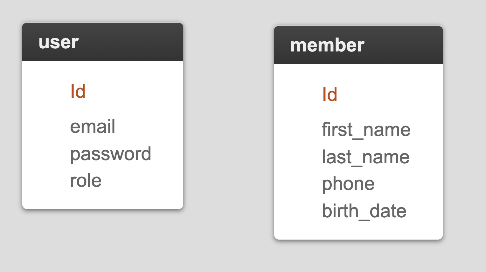
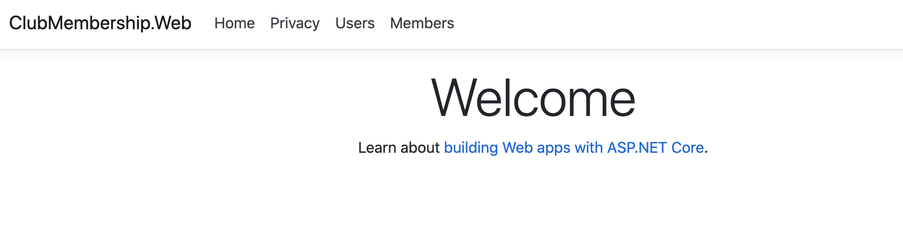
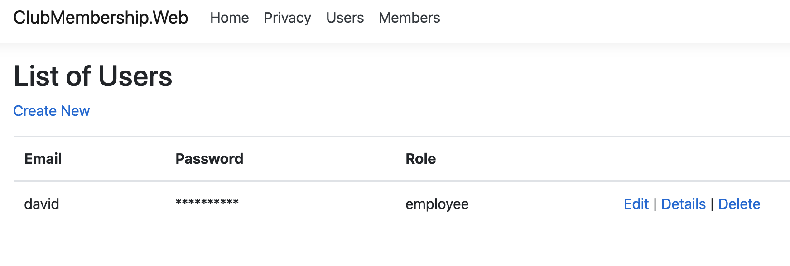
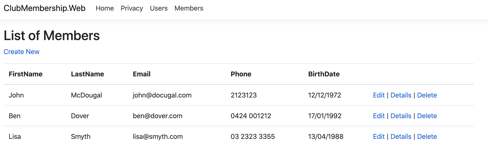
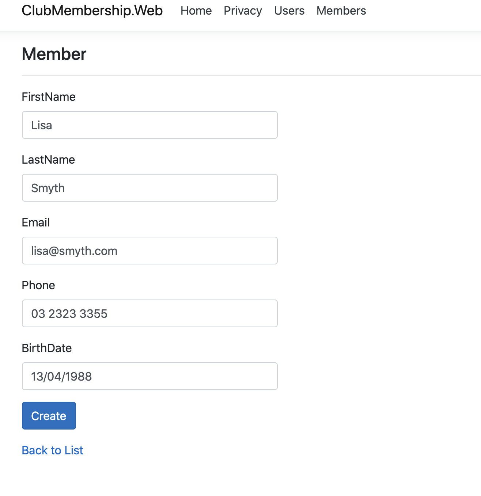
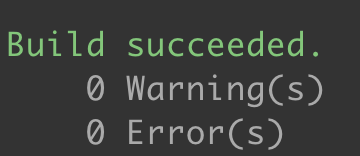
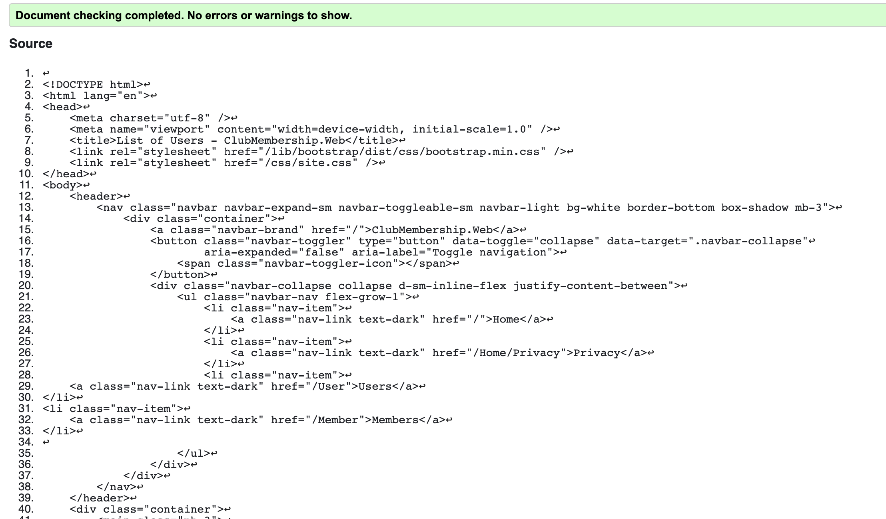

# Club Membership App  - Validation Plan 

## Section 1: Introduction 

Sydney club needs a simple membership system.
System should allow club employees to enter member details.

System should allow users to
1. Add new members
2. Update member details
3. Cancel their membership
4. Display all members


Employees can register new members
Employees can update existing members
Employees can delete members
Employees can view members

## Section 2: Validation strategies 

### Software requirements Validation

- The database is using MS-SQL
- The data tier is using Entity Framework.
- The webserver is using IIS and running within Azure
 
### Database 

MS-SQL Server was chosen as the database for storing information as it is a standard RDMS that will meet reporting and scalability needs in the future while being hosted in the cloud.

Simple ERD of the membership system is listed below.

The data tier is using Entity Framework.

### Software design 

The application is written using the MVC pattern on top of a n-tier architecture with unit tests for data, business layers.
 
The primary software design pattern for this application is MVC - Model, View, Controller

### Source code 

- The main application is written in C# V9.0 on Dot Net Version 5.
- The UI is written using bootstrap 5
 

## User Interface (UI) 

The UX prototypes were developed using BootStrap HTML generators. [Tables](https://w3codegenerator.com/bootstrap-4/tables) and [Forms](https://bootsnipp.com/forms) while the sequence diagrams have been written using Markdown

### Tests 

Unit tests have been implemented in the project `ClubMembership.Web.Unit`

Web integration tests have been implemented in the project `ClubMembership.Web.`

 
## Section 3: Prototype screenshots 





## Section 4: Software design diagrams 

Workflows for the employee

```sequence
Employee->Sign In: Can sign in

Manage->Members: Can see list of members 
Create->Members: Can create new members
Update->Members: Can update existing members
```

## Section 5: Database structure and elements 



 
## Section 6: User Interface design 

**Home Page**

---



**List employees**

---



**List members**

---



**Create member**

---




## Section 7: Code analysis tools 

**StyleCop validation**



**W3C Validation**




## Section 8: Validation results 
 

| Date     | Name  | Validate                      | Procedures   |
|----------|-------|-------------------------------|-------------|---|
| 10th May | Elena | Software Design               | Noticed that he design did not show a cancel membership screen, design includes future features such as sign in, change password and some user details   |
| 10th May | Elena |                               |              |
| 10th May | Elena | Database Design               | Noticed that the requirement of having an email address on the member was not included, and so needs to be added             |
| 10th May | Elena | UI Design                     | Was complete             |
| 10th May | Elena | Static Analyses Consistency   | Static code analysis was 100% OK, w3 HTML validator has some minor issues             |


## Section 9: Sign-off 

3rd May, 2021

Approved by teacher/assessor name

Signature teacher/assessor signature  

Validation Plan submission date: 


Approved by teacher/assessor name - replace with answer 

