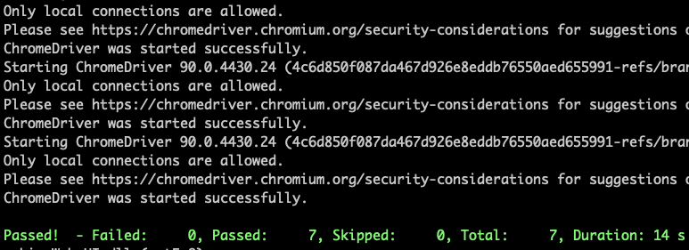
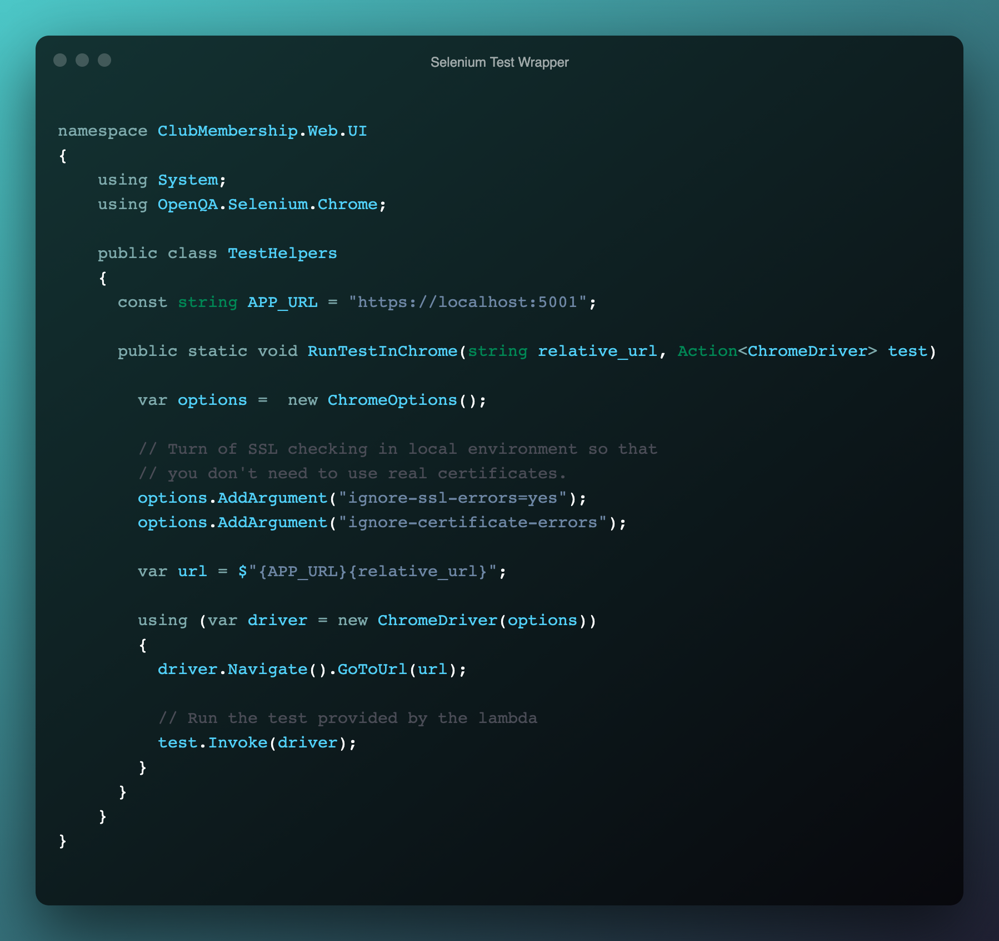
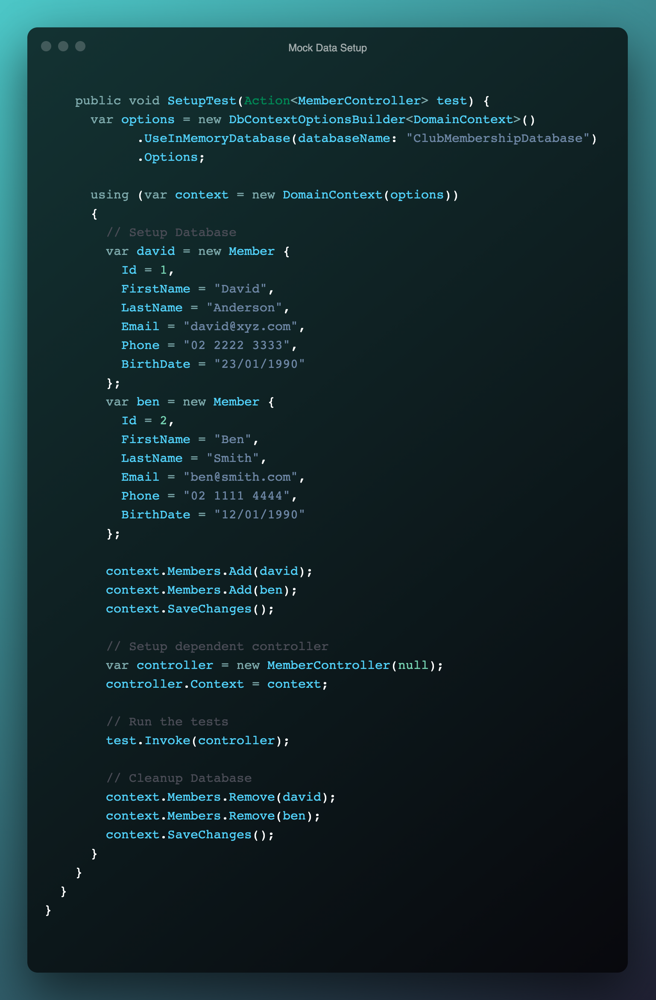
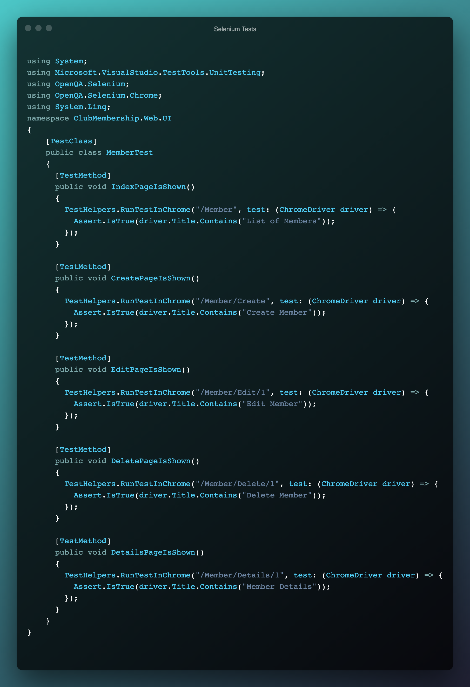
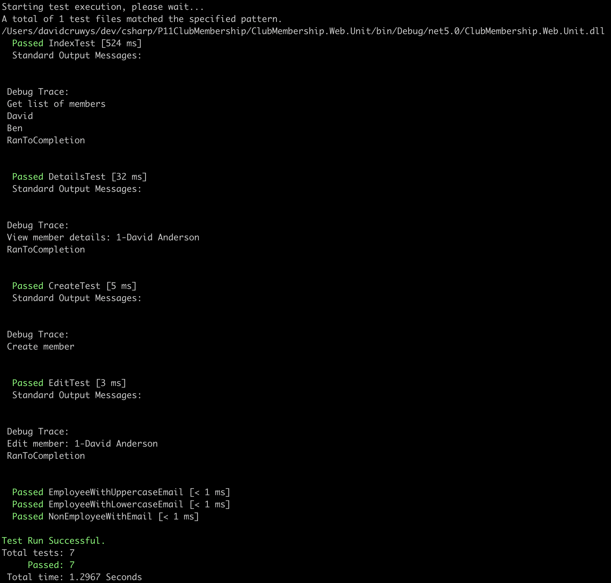
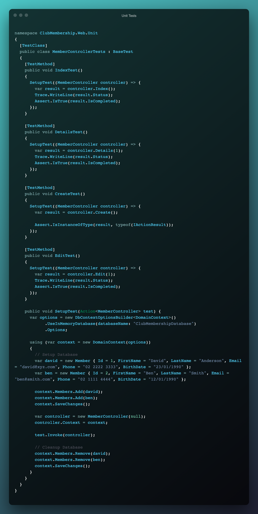

# Project Assessment: Validate and test software

Student number: 880616253

Student name: David Cruwys

### Background

One of the clubs in Sydney has contracted you to develop a simple membership system.

Currently the club has recorded their members’ details in a book but would like to start storing and managing the details electronically.

The system should allow club employees to add new members to the system, update their details, cancel their membership, and display all members’ details.

## Part 2: Perform tests

### 1 - Test environment requirements for each test

**Unit Tests**

- Add nuget packages
  - `MSTest.TestAdapter, Version: 2.1.1`
  - `MSTest.TestFramework, Version: 2.1.1`
- Setup mock database
- Add mock records
- Run target code
- Check test ran using Assertions

**UX Web Integration Tests**

- Add nuget packages
  - `MSTest.TestAdapter, Version: 2.1.1`
  - `MSTest.TestFramework, Version: 2.1.1`
  - `Selenium.WebDriver, Version: 3.141.0`
  - `Selenium.WebDriver.ChromeDriver, Version: 90`
- Setup selenium
- Instantiate chrome browser with options to run in SSL mode
- Add mock records
- Run target code
- Close the browswer connection

### 2 - Two automated test tools used and what makeas them different

**MSTest**
  
A unit testing framework that can execute code and test that the code when run with correctly setup data will return a value or update the environment in an expected manner.

**MSTest with selenium**

Turns MSTest into a web integration tool for doing automated browser requests using a real headless browser (FireFox, Chrome etc.)

This differs from automated unit tests because it interacts through the front end client in a fashion similar to a human user and thus has both benefits and weaknesses over standard unit testing.

It can test widgets that a user would interact with, such as a button or an input form.

### 3 - URLS' of research documents

??? - Add in some readme's as URLs in the repo

[Application Requirements](https://github.com/klueless-csharp-samples/P11ClubMembership/blob/master/docs/Assessment-ClubMembership.md)

### 4 - Testing steps and screenshots

The following topics are covered in this section and will be labeled using the section headings listed here:

- Test Environment Setup
- Test suite or script including input data
- Use of testing tools to execute test cases
- Test record to store result

#### Selenium Integration Tests

**Selenium Test**

> Test Environment Setup (for browser)

This environment setup will

- Load chrome
- Navigate to URL
- Run a single test that is provided via lambda expression (anonymous function) 
- Close the chrome browser

**Integration Test Execution**

> Use of testing tool for web integration

**Test Wrapper/Helper**

> Test Environment Setup (for mock data)

Mock some members in the database and ensure that data displays or is updated based on controller actions.

eg. Edit member may changes name Ben to Alice.

NOTE: This Setup will also run the test that is provided via anonymous lambda expression.

**Mocking Data**

**Test Code**

#### Unit Tests

**MSTest Unit Test Execution**

> Use of testing tool for unit testing

The second type of test will ensure that controller actions will run correctly when called with valid paramater values.

> Test suite or script including input data
> Test record to store result

**Code Unit Tests**

