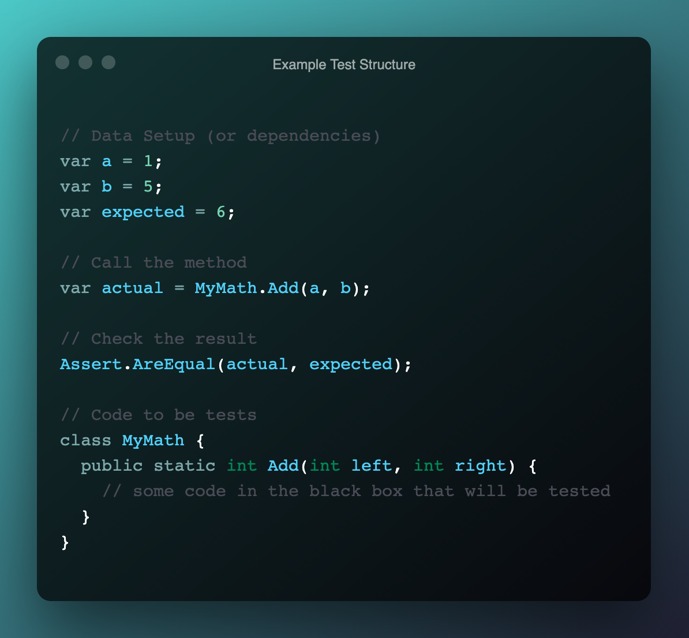
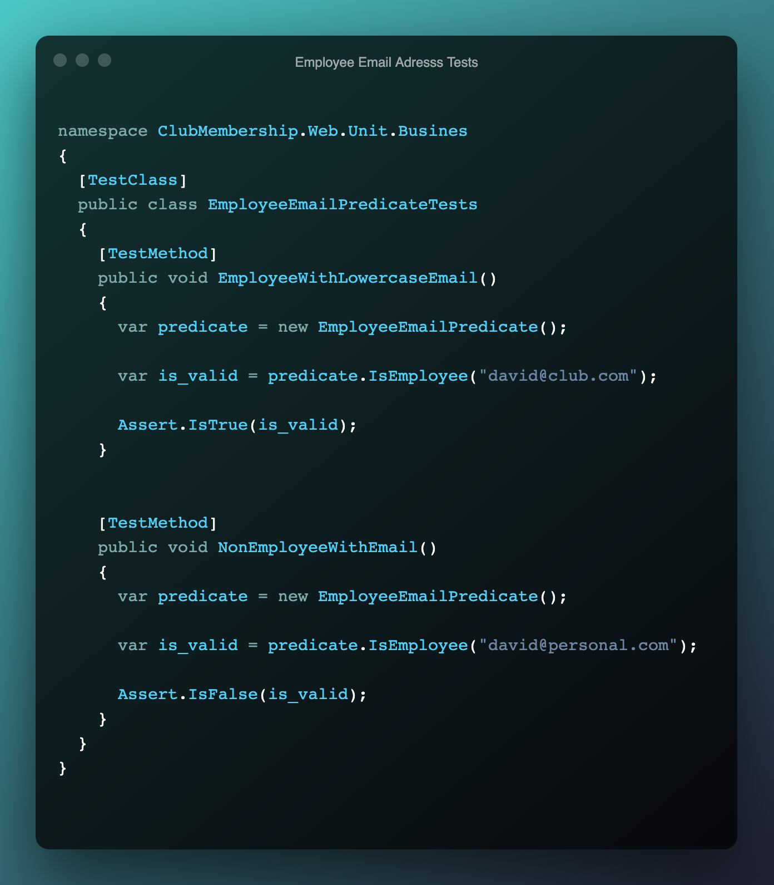

# Project Assessment: Validate and test software

Student number: 880616253

Student name: David Cruwys

### Background

One of the clubs in Sydney has contracted you to develop a simple membership system.

Currently the club has recorded their members’ details in a book but would like to start storing and managing the details electronically.

The system should allow club employees to add new members to the system, update their details, cancel their membership, and display all members’ details.

## Part 1: Prepare test document and data

#### Review and analyse the software requirements in the case study. 

The system should allow club employees to:

- add new members to the system
- update their details
- cancel their membership
- display all member details. 

The following details must be captured when adding a new member to the system:

- Name (first and last)
- Email
- Phone number
- Date of birth

#### Use cases from the software requirements:

- Club employee can see the list of all members;
- Club employee can update members details; 
- Club employee can add new members;
- Club employee can remove members;
- Club employee can access member pages for create, update, list and view;

### 1 - Select one completed use case in your application.

> "Club employee can access member pages for create, update, list and view"

### 2 - Perform research to find at least two (2) suitable tests to verify the completeness, reliability, and performance of the completed use case.

> Browser tests and unit tests. 

The first type of test will be browser tests that ensure that the webserver is serving up pages correctly based on valid URL's. 

These tests are designed to simulate users accessing various pages on the web application.

**Test Execution**


**Code**


The second type of test will ensure that controller actions will run correctly when called with valid paramater values.

**Test Execution**


**Code**


### 3 - Based on my research, determine the following:

> A: Test context and scope

**Web URL endpoints for GET requests**

Context: Browser tests will be used to ensure that the routed endpoints are accessible to the employee.

Scope: Limited to GET requires only so that we know the page is up and running.

**Controller Actions for GET request**

Context: Test that controller actions work for all GET requests (Index, Create, Edit and View Details).

Scope: Only test that the controller action runs without error when called with valid paramaters.

> B: Test standard and methodology

The methodology for establishing quality requirements, identifying, implementing, analyzing, and validating the process, and product of software quality metrics.

Examples of Testing Methodologies are Unit Testing, Integration Testing, System Testing and, Performance Testing etc. Each testing methodology has a defined test objective, test strategy, and deliverables.

Integration tests are being used to check that public end point works from a browser, these tests check that users can access system via public web endpoints.

Unit tests are being used to check that controller actions run correctly when provided with valid paramaters

> C: Test tools and types

The tools used for testing in this project include:

**Unit tests** via MsTest with standard for checking that software components are working correctly.

**Integration tests** via MsTest paired with selenium to run the webapp in a browser and check that endpoints are available for known URL's.

Software testing tools can be defined as products that support various test activities starting from planning, requirement gathering, build creation, test execution, defect logging and test analysis. 

These testing tools are mainly used for testing software firmness, thoroughness, and other performance parameters.

Examples include CI tools such and Code Climate plus Git HubActions, Unit Testing such as MsTest and RSpec and Integration testing tools such as Selenium.

Testing Categories.

- Functional Testing
- Non-Functional Testing or 
- Performance Testing

Test Types
- Functional Testing
- Unit Testing
- Integration Testing
- Smoke
- UAT ( User Acceptance Testing)
- Localization
- Internationalization

Performance Tests

- Performance
- Load
- Scalability
- Usability

> D: Test design techniques

Test Design is creating a set of inputs for given software that will provide a set of expected outputs.

The idea is to ensure that the system is working good enough and it can be released with as few problems as possible for the average user.

Test Design Techniques

 - Static Techniques
 - Dynamic Techniques

Dynamic testing technique is the type of testing that validates the functionality of an application when the code is executed / by executing the code, examples include unit tests and integration tests.

Static testing means there are no changing conditions or parameters, examples manual examinations such as code review and walk through and automated tools such as static code analysis and linters.

### 4 - Design test cases

> A: Design test cases using static test design technique

Code walk-through/demonstration.

User Acceptance Testing - UAT is based on a user running the application and checking that it works while using normal workflows.

> B: Design test cases using dynamic test design technique

Code that runs automatically, eg. unit tests

Unit tests require the following concepts

- Data setup, so that you have useful inputs and dependencies
- Execution of the code ot be tested.
- Fixed and known expectations



> C: Design test cases using appropriate test input data determined from the requirements

Mock some members in the database and ensure that data displays or is updated based on congtroller actions. eg. Edit member may changes name bob to jane.


> D: Design test using appropriate formatting including test case number, description, preconditions, steps, expected result, and tool name (if applicable).

```bash
Test case number: #1001
Title           : Employee Email Predicate
Description     : When member email contains @club.com, member is an employee

Test steps      : valid email address with the domain name david@club.com
Expected result : true

Test steps      : valid email address with the domain name david@personal.com
Expected result : false
```

**Code to be tested**


**Unit test examples**



END OF PART1


PART 2


1. Test environment requirements for each test

- UNIT TESTS
- add nuget packages
- setup mock db
- add mock records
- run target code
- check test ran

- UX TESTS
- setup selenium
- instantiate chrome browser wqith options
- close the browswer connection

2. Two automated test tools used and what makeas them different

mstest
mstest with selenium

3. URLS' of research documents

add in some readmes that as URLs in the repo


4. Testing test

Unit - screenshots
Selenium - screenshots

Test result


PART 3

1. Defects found

- employee email predicated failed for @work.com.au

2. Debugging steps to track the defect.

Showed code with valid work address that returned true
and invalid work address that also retruend true

The second would be the failure 

Screen shot before and after the fix

3. Details of fgixes implemented

4. Testresults after Debugging
   
PART 4

See test plan document.docx


Assessment 4

PART 1

1. Identify a suitable logging framework and its functions

System.Trace (allows for logging of text to different sink providers such as console or file)

2. Create custom efventvlog messagews using the logging framework. Include screenshots

Make sure I demonstrate, log level (debug, info), timestamp, if condition messages useful

Include links to each file:line # as URLS

Application Event:
  startup.cs
    AppStarted
Database events
  Membership.cs (DBContext)
    Member Created: david
HTTP Requests
    List of members (controller)
    David
    Ben
Execeptions
  -1 to show controller should log exception

3. Run the applicatyion

Print screen the output

4. Analysy the captured log messages and indicate the following:

- Operation performed and it's result
  - member 1, logged out david as expected
- Execution flow issues
  - have not got a catch for member -3
- Application errors
  - Did find an app error when trying to show member -3
- Performance issues: before and after timestamps - these well point out any performance issues in production


PART 2

1. Two debug tools and their function

Trace is a tool for printint internal state to console, file, etc...
Log4Net: is a move powerful version of above for enterprise with many out put proivders such as slack and sms

2. Debugging steps and screenshots

RUN the code in debug Model
Put a break point
Print a local variable
Show stack trace
Screenshots go here

3. Code to write debug messages to a file.

- Show the code example for adding tracelistener to file output stream.
- Show the log messages in the Field
- Conditional message using assert - (david vs ben) can have different messages
- Stop/close the output stream (show the code)


PART 3

Profiling tools

1. At least two profiling tools and their functions

Is Site Running.com: let you know if site is running

stackify prefix / retrace
open source visual studio profiler

Find 2 nuget profilers and just run them

2. Screenshot with Ram and Usage stats
3. Which part of application consuremd resources
4. Changes implement4ed to improve performance
   1. show code to a memoized db lookup


PART 4


