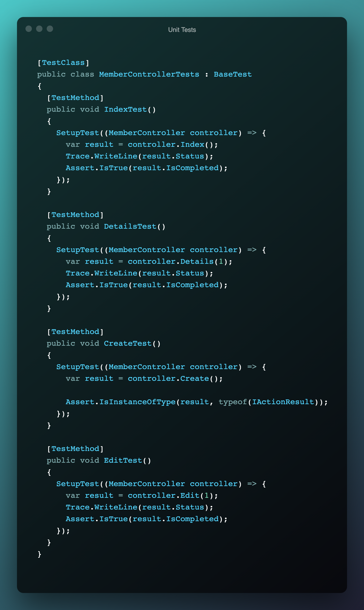

# Project Assessment: Validate and test software

Student number: 880616253

Student name: David Cruwys

### Background

One of the clubs in Sydney has contracted you to develop a simple membership system.

Currently the club has recorded their members’ details in a book but would like to start storing and managing the details electronically.

The system should allow club employees to add new members to the system, update their details, cancel their membership, and display all members’ details.

## Part 2: Perform tests

> 1 - Test environment requirements for each test

**Unit Tests**

- Add nuget packages
  - `MSTest.TestAdapter, Version: 2.1.1`
  - `MSTest.TestFramework, Version: 2.1.1`
- Setup mock database
- Add mock records
- Run target code
- Check test ran using Assertions

**UX Web Integration Tests**

- Add nuget packages
  - `MSTest.TestAdapter, Version: 2.1.1`
  - `MSTest.TestFramework, Version: 2.1.1`
  - `Selenium.WebDriver, Version: 3.141.0`
  - `Selenium.WebDriver.ChromeDriver, Version: 90`
- Setup selenium
- Instantiate chrome browser with options to run in SSL mode
- Add mock records
- Run target code
- Close the browswer connection

> 2 - Two automated test tools used and what makeas them different

**MSTest**
  
A unit testing framework that can execute code and test that the code when run with correctly setup data will return a value or update the environment in an expected manner.

**MSTest with selenium**

Turns MSTest into a web integration tool for doing automated browser requests using a real headless browser (FireFox, Chrome etc.)

This differs from automated unit tests because it interacts through the front end client in a fashion similar to a human user and thus has both benefits and weaknesses over standard unit testing.

It can test widgets that a user would interact with, such as a button or an input form.

> 3 - URLS' of research documents

??? - Add in some readme's as URLs in the repo

[Application Requirements](https://github.com/klueless-csharp-samples/P11ClubMembership/blob/master/docs/Assessment-ClubMembership.md)

> 4 - Testing steps and screenshots

The following topics are covered and labeled

- Test Environment Setup
- Test suite or script including input data
- Use of testing tools to execute test cases
- Test record to store result

**Selenium Test Wrapper/Helper**

> Test Environment Setup (for browser)

This environment setup will

- Load chrome, 
- Goto a URL
- Run a specific test and 
- Then close the chrome browser

> Test Environment Setup (for mock data)

Mock some members in the database and ensure that data displays or is updated based on controller actions.

eg. Edit member may changes name Ben to Alice.

NOTE: This Setup will also run the test that is provided via anonymous lambda expression.

**Selenium Web Integration Test Execution**

> Use of testing tool for web integration

**Selenium Test Code**

**MSTest Unit Test Execution**

> Use of testing tool for unit testing

The second type of test will ensure that controller actions will run correctly when called with valid paramater values.

> Test suite or script including input data
> Test record to store result

**Code Unit Tests**

PART 3

1. Defects found

- employee email predicated failed for @work.com.au

2. Debugging steps to track the defect.

Showed code with valid work address that returned true
and invalid work address that also retruend true

The second would be the failure 

Screen shot before and after the fix

3. Details of fgixes implemented

4. Testresults after Debugging
   
PART 4

See test plan document.docx

Assessment 4

PART 1

1. Identify a suitable logging framework and its functions

System.Trace (allows for logging of text to different sink providers such as console or file)

2. Create custom efventvlog messagews using the logging framework. Include screenshots

Make sure I demonstrate, log level (debug, info), timestamp, if condition messages useful

Include links to each file:line # as URLS

Application Event:
  startup.cs
    AppStarted
Database events
  Membership.cs (DBContext)
    Member Created: david
HTTP Requests
    List of members (controller)
    David
    Ben
Execeptions
  -1 to show controller should log exception

3. Run the applicatyion

Print screen the output

4. Analysy the captured log messages and indicate the following:

- Operation performed and it's result
  - member 1, logged out david as expected
- Execution flow issues
  - have not got a catch for member -3
- Application errors
  - Did find an app error when trying to show member -3
- Performance issues: before and after timestamps - these well point out any performance issues in production

PART 2

1. Two debug tools and their function

Trace is a tool for printint internal state to console, file, etc...
Log4Net: is a move powerful version of above for enterprise with many out put proivders such as slack and sms

2. Debugging steps and screenshots

RUN the code in debug Model
Put a break point
Print a local variable
Show stack trace
Screenshots go here

3. Code to write debug messages to a file.

- Show the code example for adding tracelistener to file output stream.
- Show the log messages in the Field
- Conditional message using assert - (david vs ben) can have different messages
- Stop/close the output stream (show the code)

PART 3

Profiling tools

1. At least two profiling tools and their functions

Is Site Running.com: let you know if site is running

stackify prefix / retrace
open source visual studio profiler

Find 2 nuget profilers and just run them

2. Screenshot with Ram and Usage stats
3. Which part of application consuremd resources
4. Changes implement4ed to improve performance
   1. show code to a memoized db lookup

PART 4

