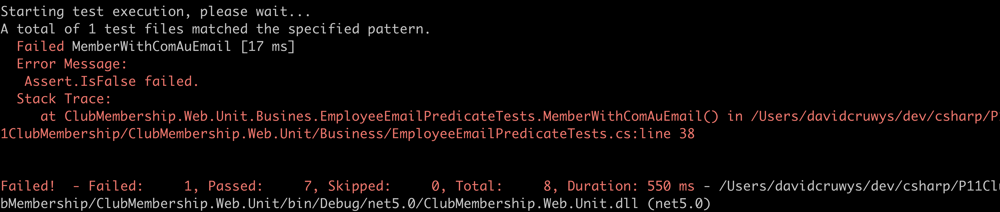
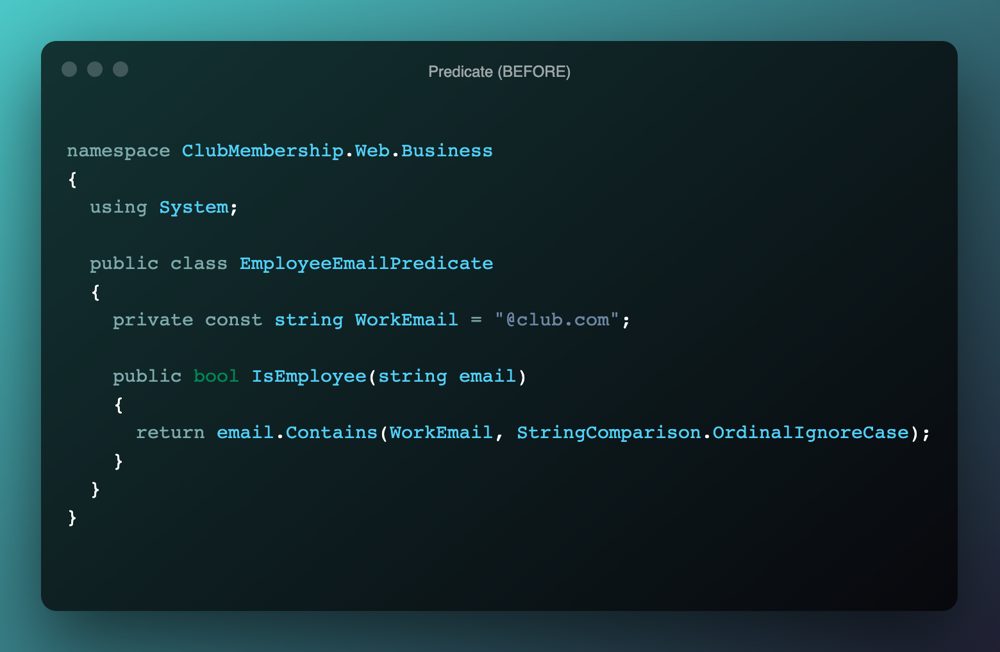
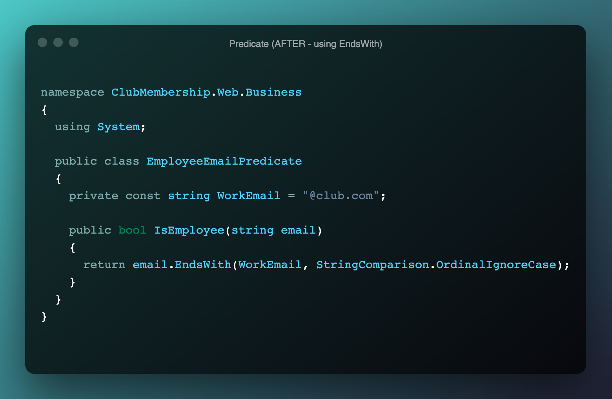
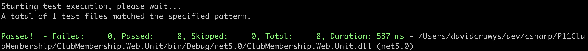

# Project Assessment: Validate and test software

Student number: 880616253

Student name: David Cruwys

### Background

One of the clubs in Sydney has contracted you to develop a simple membership system.

Currently the club has recorded their members’ details in a book but would like to start storing and managing the details electronically.

The system should allow club employees to add new members to the system, update their details, cancel their membership, and display all members’ details.

1. Defects found

- Employee email predicated failed for @club.com.au

The employee predicate class is a validation that checks if a member email address is for someone who works at the club.

Employees can be members, but we want to flag that they are also employees.

example emails for employees include david@club.com and alice@club.com and this code works OK, but a billy@club.com.au [note the .AU] registered as a member and he is not an employee.

1. Debugging steps to track the defect.

I went to the list of members and found a member who was also an employee `david@club.com` and changed the email address to `billy@club.com.au` and the flag for employee did not change.

So then went and created a new test for `billy@club.com.au`, see below and the test also failed.

**Test Failing**

**Unit Test Code**

The middle (or 2nd) test is the new test that was added is is currently failing.

**Screen shot before**

The existing code checks if `"@club.com"` exists in the email address, this is fine for .com, but not good for `"@club.com.au" or "@club.com.xyz"`

**Screen shot after**

Changed `.Contains` to `.EndsWith`

### Test Results after Debugging

   
PART 4

See test plan document.docx

Assessment 4

PART 1

1. Identify a suitable logging framework and its functions

System.Trace (allows for logging of text to different sink providers such as console or file)

2. Create custom efventvlog messagews using the logging framework. Include screenshots

Make sure I demonstrate, log level (debug, info), timestamp, if condition messages useful

Include links to each file:line # as URLS

Application Event:
  startup.cs
    AppStarted
Database events
  Membership.cs (DBContext)
    Member Created: david
HTTP Requests
    List of members (controller)
    David
    Ben
Execeptions
  -1 to show controller should log exception

3. Run the applicatyion

Print screen the output

4. Analysy the captured log messages and indicate the following:

- Operation performed and it's result
  - member 1, logged out david as expected
- Execution flow issues
  - have not got a catch for member -3
- Application errors
  - Did find an app error when trying to show member -3
- Performance issues: before and after timestamps - these well point out any performance issues in production

PART 2

1. Two debug tools and their function

Trace is a tool for printint internal state to console, file, etc...
Log4Net: is a move powerful version of above for enterprise with many out put proivders such as slack and sms

2. Debugging steps and screenshots

RUN the code in debug Model
Put a break point
Print a local variable
Show stack trace
Screenshots go here

3. Code to write debug messages to a file.

- Show the code example for adding tracelistener to file output stream.
- Show the log messages in the Field
- Conditional message using assert - (david vs ben) can have different messages
- Stop/close the output stream (show the code)

PART 3

Profiling tools

1. At least two profiling tools and their functions

Is Site Running.com: let you know if site is running

stackify prefix / retrace
open source visual studio profiler

Find 2 nuget profilers and just run them

2. Screenshot with Ram and Usage stats
3. Which part of application consuremd resources
4. Changes implement4ed to improve performance
   1. show code to a memoized db lookup

PART 4

