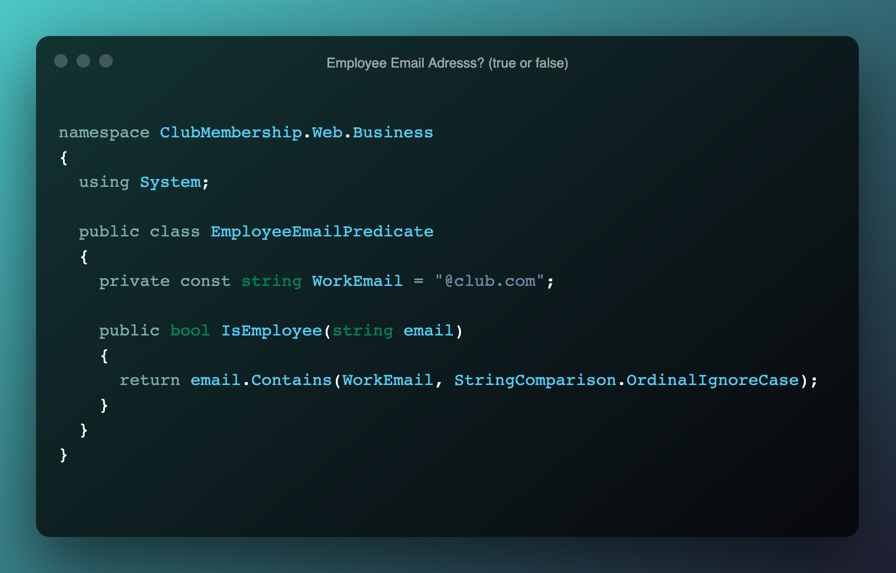
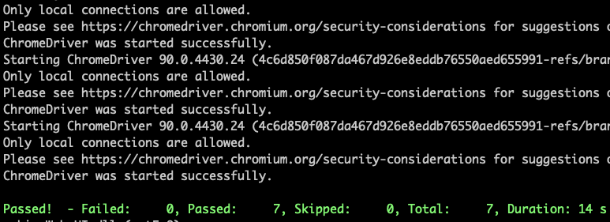
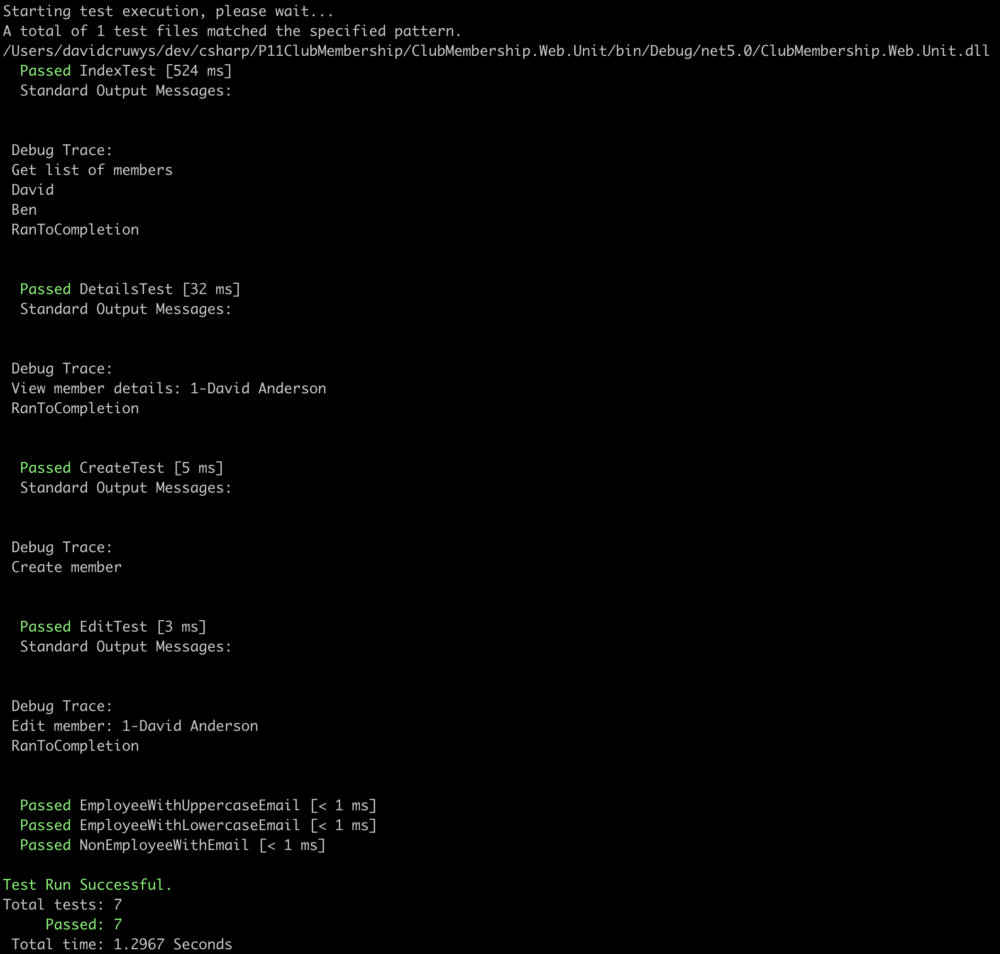

# Part 4

# Project Assessment: Validate and test software

Student number: `880616253`

Student name: `David Cruwys`

### Background

One of the clubs in Sydney has contracted you to develop a simple membership system.

Currently the club has recorded their members’ details in a book but would like to start storing and managing the details electronically.

The system should allow club employees to add new members to the system, update their details, cancel their membership, and display all members’ details.

## Part 4: Document and manage test results

[Application Code](https://github.com/klueless-csharp-samples/P11ClubMembership/tree/master/ClubMembership.Web)

[Unit Test Code]()

[Integration Test Code](https://github.com/klueless-csharp-samples/P11ClubMembership/tree/master/ClubMembership.Web.UI)


---

The rest of this document is just pasted from part 1, 2 and 3

---

## Part 1: Prepare test document and data

#### Review and analyse the software requirements in the case study. 

The system should allow club employees to:

- add new members to the system
- update their details
- cancel their membership
- display all member details. 

The following details must be captured when adding a new member to the system:

- Name (first and last)
- Email
- Phone number
- Date of birth

#### Use cases from the software requirements:

- Club employee can see the list of all members;
- Club employee can update members details; 
- Club employee can add new members;
- Club employee can remove members;
- Club employee can access member pages for create, update, list and view;

### 1 - Select one completed use case in your application.

> "Club employee can access member pages for create, update, list and view"

### 2 - Perform research to find at least two (2) suitable tests to verify the completeness, reliability, and performance of the completed use case.

> Browser tests and unit tests. 

**Browser Test**

The first type of test will be browser tests that ensure that the webserver is serving up pages correctly based on valid URL's. 

These tests are designed to simulate users accessing various pages on the web application.

**Unit Test**

The second type of test will ensure that controller actions and business services will run correctly when called with valid paramater values.

### 3 - Based on my research, determine the following:

> A: Test context and scope

**Web URL endpoints for GET requests**

Context: Browser tests will be used to ensure that the routed endpoints are accessible to the employee.

Scope: Limited to GET requires only so that we know the page is up and running.

**Controller Actions for GET request**

Context: Test that controller actions work for all GET requests (Index, Create, Edit and View Details).

Scope: Only test that the controller action runs without error when called with valid paramaters.

> B: Test standard and methodology

The methodology for establishing quality requirements, identifying, implementing, analyzing, and validating the process, and product of software quality metrics.

**Examples of Testing Methodologies**

Examples include Unit Testing, Integration Testing, System Testing and, Performance Testing etc. Each testing methodology has a defined test objective, test strategy, and deliverables.

Integration tests are being used to check that public end point works from a browser, these tests check that users can access system via public web endpoints.

Unit tests are being used to check that controller actions run correctly when provided with valid paramaters

> C: Test tools and types

The tools used for testing in this project include:

**Unit tests** via MsTest with standard for checking that software components are working correctly.

**Integration tests** via MsTest paired with selenium to run the webapp in a browser and check that endpoints are available for known URL's.

Software testing tools can be defined as products that support various test activities starting from planning, requirement gathering, build creation, test execution, defect logging and test analysis. 

These testing tools are mainly used for testing software firmness, thoroughness, and other performance parameters.

Examples include CI tools such and Code Climate plus Git HubActions, Unit Testing such as MsTest and RSpec and Integration testing tools such as Selenium.

Testing Categories.

- Functional Testing
- Non-Functional Testing or 
- Performance Testing

Test Types
- Functional Testing
- Unit Testing
- Integration Testing
- Smoke
- UAT ( User Acceptance Testing)
- Localization
- Internationalization

Performance Tests

- Performance
- Load
- Scalability
- Usability

> D: Test design techniques

Test Design is creating a set of inputs for given software that will provide a set of expected outputs.

The idea is to ensure that the system is working good enough and it can be released with as few problems as possible for the average user.

Test Design Techniques

 - Static Techniques
 - Dynamic Techniques

Dynamic testing technique is the type of testing that validates the functionality of an application when the code is executed / by executing the code, examples include unit tests and integration tests.

Static testing means there are no changing conditions or parameters, examples manual examinations such as code review and walk through and automated tools such as static code analysis and linters.

### 4 - Design test cases

> A: Design test cases using static test design technique

Code walk-through/demonstration.

User Acceptance Testing - UAT is based on a user running the application and checking that it works while using normal workflows.

I'll be using page load tests for each of the membership pages, create, update, remove, list and show to ensure that the page is actually accessible by the user.

> B: Design test cases using dynamic test design technique

Code that runs automatically, eg. unit tests

Unit tests require the following concepts

- Data setup, so that you have useful inputs and dependencies
- Execution of the code ot be tested.
- Fixed and known expectations

I'll be using unit tests that test controller actions and a business service.

Here is a simple example of how a test could lookup

**Example only**


> C: Design test cases using appropriate test input data determined from the requirements

Mock some members in the database and ensure that data displays or is updated based on controller actions.

eg. Edit member may changes name bob to jane.


> D: Design test using appropriate formatting including test case number, description, preconditions, steps, expected result, and tool name (if applicable).

```bash
Test case number: #1001
Title           : Employee Email Predicate
Description     : When member email contains @club.com, member is an employee

Test steps      : valid email address with the domain name david@club.com
Expected result : true

Test steps      : valid email address with the domain name david@personal.com
Expected result : false
```

#### Example code

Example code for Employee Email Predicate
  
**Code to be tested**



**Unit test examples**


## Part 2: Perform tests

### 1 - Test environment requirements for each test

**Unit Tests**

- Add nuget packages
  - `MSTest.TestAdapter, Version: 2.1.1`
  - `MSTest.TestFramework, Version: 2.1.1`
- Setup mock database
- Add mock records
- Run target code
- Check test ran using Assertions

**UX Web Integration Tests**

- Add nuget packages
  - `MSTest.TestAdapter, Version: 2.1.1`
  - `MSTest.TestFramework, Version: 2.1.1`
  - `Selenium.WebDriver, Version: 3.141.0`
  - `Selenium.WebDriver.ChromeDriver, Version: 90`
- Setup selenium
- Instantiate chrome browser with options to run in SSL mode
- Add mock records
- Run target code
- Close the browswer connection

### 2 - Two automated test tools used and what makeas them different

**MSTest**
  
A unit testing framework that can execute code and test that the code when run with correctly setup data will return a value or update the environment in an expected manner.


**MSTest with selenium**


Turns MSTest into a web integration tool for doing automated browser requests using a real headless browser (FireFox, Chrome etc.)

This differs from automated unit tests because it interacts through the front end client in a fashion similar to a human user and thus has both benefits and weaknesses over standard unit testing.

It can test widgets that a user would interact with, such as a button or an input form.

### 3 - URLS' of research documents

??? - Add in some readme's as URLs in the repo

[Application Requirements](https://github.com/klueless-csharp-samples/P11ClubMembership/blob/master/docs/Assessment-ClubMembership.md)

### 4 - Testing steps and screenshots

The following topics are covered in this section and will be labeled using the section headings listed here:

- Test Environment Setup
- Test suite or script including input data
- Use of testing tools to execute test cases
- Test record to store result

#### Selenium Integration Tests

**Selenium Test**

> Test Environment Setup (for browser)

This environment setup will

- Load chrome
- Navigate to URL
- Run a single test that is provided via lambda expression (anonymous function) 
- Close the chrome browser

**Integration Test Execution**

> Use of testing tool for web integration



**Test Wrapper/Helper**


> Test Environment Setup (for mock data)

Mock some members in the database and ensure that data displays or is updated based on controller actions.

eg. Edit member may changes name Ben to Alice.

NOTE: This Setup will also run the test that is provided via anonymous lambda expression.

**Mocking Data**


**Test Code**

This is a list of each test that runs, these tests are designed to simulate users accessing various pages on the web application.


#### Unit Tests

> Use of testing tool for unit testing

The second type of test will ensure that controller actions and business services will run correctly when called with valid paramater values.

**Unit Test Execution**



> Test suite or script including input data
> Test record to store result

**Unit Test Setup/Teardown**

- Setup test data
- Create a controller
- Run specific test
- Remove test data


**Code Unit Tests**

Test each action in the controller


## Part 3: Document and manage test results

Evaluate test results to identify defect.
Track the defect and verify fixes.


```bash
Bug Ticket      : #9001
Title           : Employee Email Predicate
Description     : When a standard member was added with a domain name similar to our club, it assumed that the member was an employee when really they were not

Test steps      : use a valid email address that starts with our club domain, but has extra extension in it.
Example data    : david@club.com.au or david@club.nz
Expected result : Standard member
Actual result   : Employee

```

### 1 - Details of defect found

- Employee email predicated failed for @club.com.au

The employee predicate class is a validation that checks if a member email address is for someone who works at the club.

Employees can be members, but we want to flag that they are also employees.

example emails for employees include david@club.com and alice@club.com and this code works OK, but a billy@club.com.au [note the .AU] registered as a member and he is not an employee.

### 2 - Debugging steps to track the defect.

I went to the list of members and found a member who was also an employee `david@club.com` and changed the email address to `billy@club.com.au` and the flag for employee did not change.

So then went and created a new test for `billy@club.com.au`, see below and the test also failed.

**Test Failing**


**Unit Test Code**

The middle (or 2nd) test is the new test that was added is is currently failing.


**Screen shot before**

The existing code checks if `"@club.com"` exists in the email address, this is fine for .com, but not good for `"@club.com.au" or "@club.com.xyz"`


**Screen shot after**

Changed `.Contains` to `.EndsWith`


### Test Results after Debugging

Test results after debugging: ALL GOOD

   
