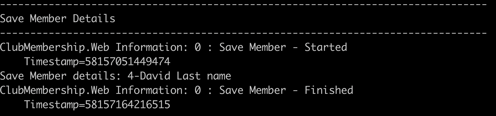

# Project Assessment 4: Logging Framework and Functions

## PART 1

Student number: 880616253

Student name: David Cruwys

### Background

One of the clubs in Sydney has contracted you to develop a simple membership system.

### 1. Identify a suitable logging framework and its functions

Framework `System.Trace`

This core library allows for logging of text to different sink providers such as console or file.

You can log for debug, informational and exceptional reasons and you can use type-safe and conditional logging methods.

### 2. Create custom event log messages using the logging framework. 

Demonstrate:  Log level (debug, info), timestamp, conditional messages

The Trace Events listed give detailed information about application startup

[See Source](https://github.com/klueless-csharp-samples/P11ClubMembership/tree/master/ClubMembership.Web/Startup.cs)

### 3. Run the application

Print screen the output

### 4. Analyse the captured log messages and indicate the following:

When listing members: https://localhost:5001/Member we should be able see what member names were returned to the user via the log.

We should get a conditional message about if there is a lot of members or only a few.

When viewing a member with a valid ID: https://localhost:5001/Member/Details/5

> We should see the member debug and trace messages in the File Log and console.

> We should see the member ID and full name in the console log.

When exception happens: https://localhost:5001/Member/Details/69

> We should be able to see exceptional issues in the log file. User `69` is not allowed and will throw an exception.

Application Performance/Instrumentation

> How fast is the Save to Database code

`POST` https://localhost:5001/Member/Edit/5

