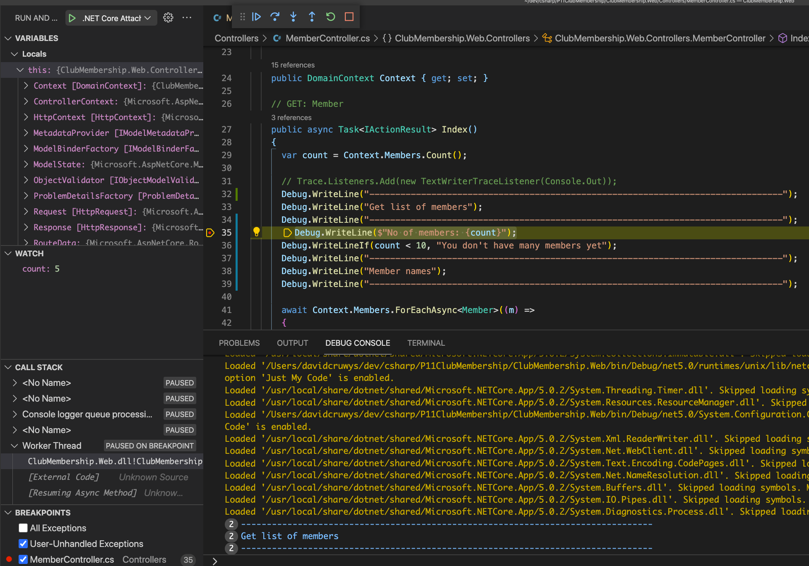
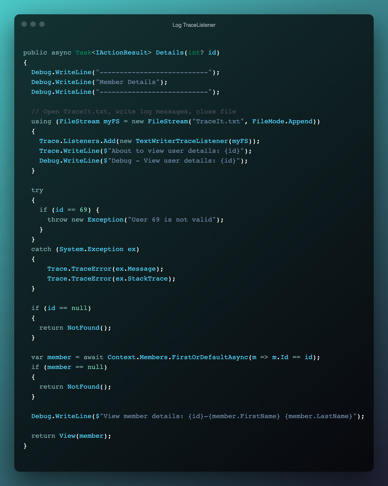
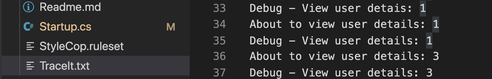

# Project Assessment 4: Logging Framework and Functions

## PART 2

Student number: 880616253

Student name: David Cruwys

### Background

One of the clubs in Sydney has contracted you to develop a simple membership system.

### 1. Two debug tools and their function

Trace is a tool for printing internal state to console, file, etc...

Log4Net: is a more powerful version of above for enterprise logging with many output providers.

You can create your own output providers or use 3rd party providers for specialized outputs such as Slack and SMS.

### 2. Debugging steps and screenshots

- RUN the code in debug Model
- Put a break point
- Print a local variable
- Show stack trace

### 3. Code to write debug messages to a file.

> Show the code example for adding TraceListener to file output stream.

