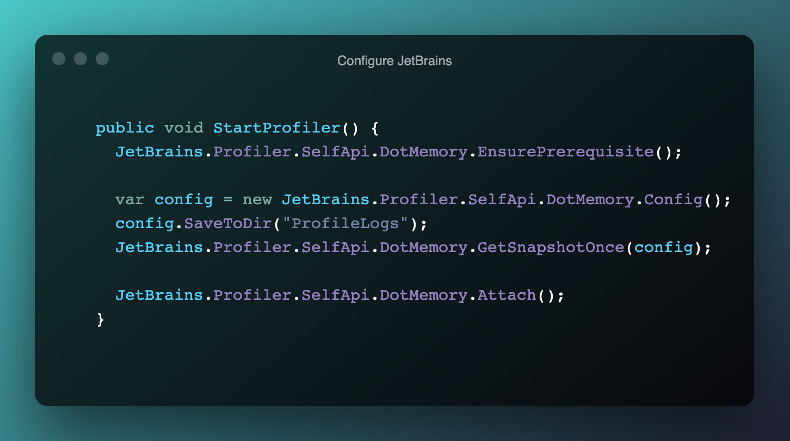
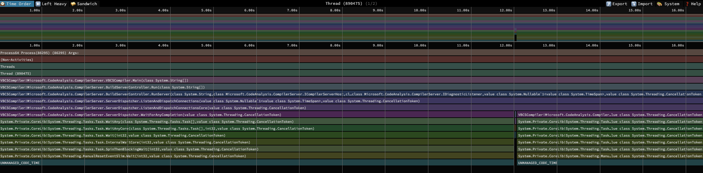
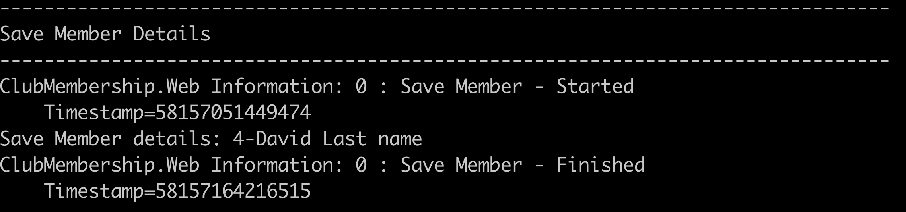

# Project Assessment 4: Logging Framework and Functions

## PART 3

Student number: 880616253

Student name: David Cruwys

### Background

One of the clubs in Sydney has contracted you to develop a simple membership system.

## Profiling tools

### 1. At least two profiling tools and their functions

Is site running: https://www.uptrends.com/tools/uptime

Will ping your website on a periodical basis and alert you know if site is down.

### 2. At least two profiling tools and their functions

[JetBrains.Profiler.SelfApi](https://github.com/JetBrains/profiler-self-api)



I got it running, but I could not visulize the output file because I'm using VSCode.

[dotnet-trace performance analysis utility](https://docs.microsoft.com/en-us/dotnet/core/diagnostics/dotnet-trace)

```bash
ps -ax | dotnet
# => 86295 ttys001    0:03.46 /usr/local/share/dotnet/dotnet /usr/local/share/dotnet/sdk/5.0.102/Sdks/Microsoft.NET.Sdk.Razor/tools/rzc.dll server -p davidcruwys.1ZP8JDsPgD0Lu3wc9+VdXLyUd

# Use this to collect metrics while running website
dotnet trace collect -p 86295

# Use this to convert into a SpeedScope JSON file
dotnet trace convert --format speedscope dotnet_20210621_204505.nettrace
```

```JSON
{
  "exporter": "Microsoft.Diagnostics.Tracing.TraceEvent@2.0.64.0",
  "name": "dotnet_20210621_204505.speedscope",
  "activeProfileIndex": 0,
  "$schema": "https://www.speedscope.app/file-format-schema.json",
  "shared": {
    "frames": [
      { "name": "Process64 Process(86295) (86295) Args: " },
      { "name": "(Non-Activities)" },
      { "name": "Threads" },
      { "name": "Thread (890475)" },
      { "name": "VBCSCompiler!Microsoft.CodeAnalysis.CompilerServer.VBCSCompiler.Main(class System.String[])" },
      { "name": "VBCSCompiler!Microsoft.CodeAnalysis.CompilerServer.BuildServerController.Run(class System.String[])" }
    ]
  }
}
```



### Identify the parts that are using most resources

I identified using instrumentation that persisting of users was taking too long.

### Changes implemented to improve performances

Added timer softare before and after
Check how long it was taking
Realized that an index was missing, added the index and time is now in acceptable limits


`POST` https://localhost:5001/Member/Edit/5

