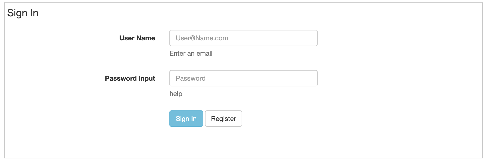
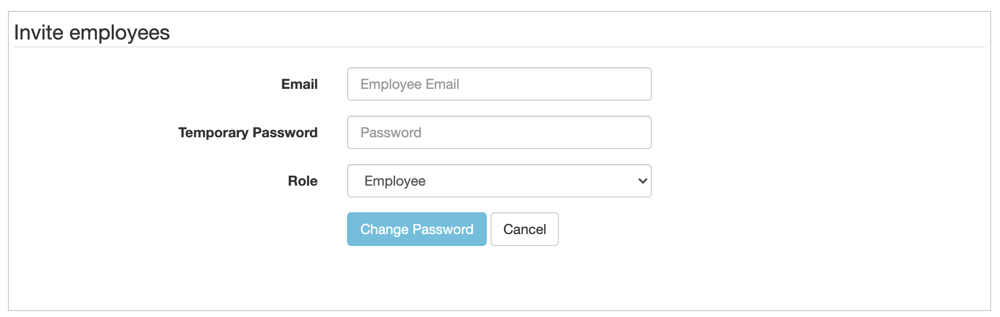
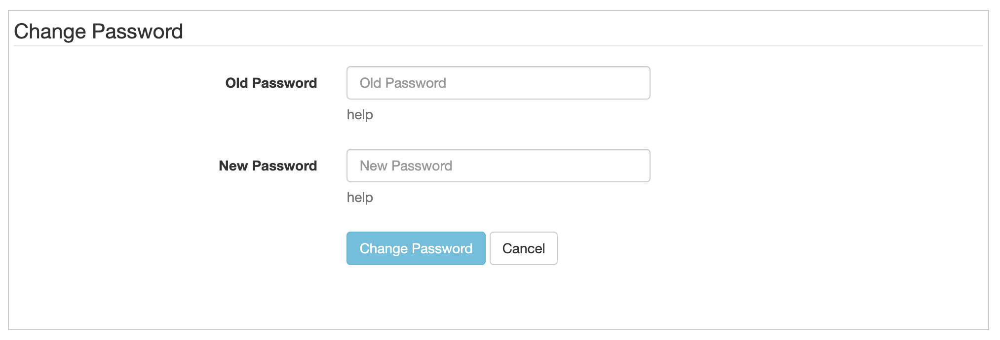
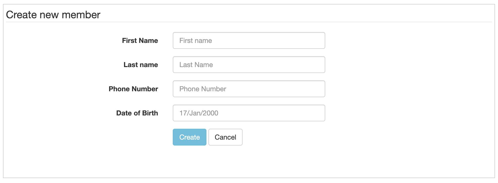
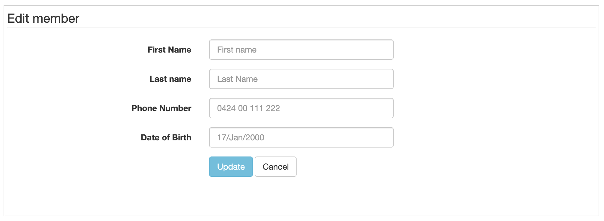
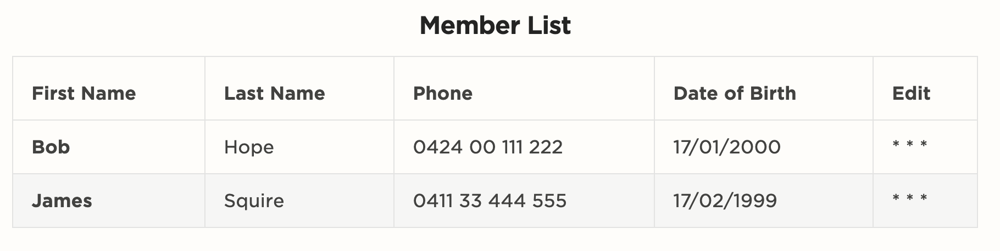

# Club Membership Application

## Assessment Tasks

Validate Software

### PART 1

1. Develop a proof of concept
2. Present the prototype system
3. Perform design and code validation
4. Document and report validation results

A. Determine the procedures and tools required to perform

* Software requirements validation
  * Create a validation plan
    * Description of the system, environment specifications, assumptions, limitiations, testing criteria, acceptance criteria, identification of the validation team including the responsibilities of each individual, required procedures and require documentaiton
  * Define system requirements
    * SRS
  * Create the validation protocol and test specifications
    * Linting, Static Code Analisys
  * Testing
    * Unit Testing
  * Requirements meets the operational and system level needs
* Database validation
  * 
* Software design validation
  * What is the primary software design pattern
  * Are there layers, subsystems, microservices
  * What types of components
    * Models, Business Actions, Query Objects, Controllers, API, Unit Tests
* Source code validation
  * 
* User Interface (UI) validation
  * konceptapp.com
  * 
* Test validation
  * 

B. Now it is time to design and build a prototype.
1. Identify a prototyping tool to develop proof of concept
2. Identify the use cases from the software requirements.
3. Develop a prototype using the selected tool.

C. Save your word-processed document as VDP_Part1

### PART 2

10-15 minutes to present your prototype

Role Play Participants:
  Client and Developer.

1. Identify each use case requirements that you need to fulfil
2. Confirm the completeness and correctness of the requirements using appropriate questioning and listening techniques.
3. Demonstrate the prototype (from Part 1) to the client and determine whether any further refinements need to be made.
4. Record the outcome of the presentation and any changes required in a document.

  ### PART 3

Now you have implement selected use cases, its time for you to validate it.

Record your validation details
- Date
- Name
- Procedures
- Results (including screen shots)

1. Validate the software design to ensure the design is complete, accurate and feasible.
   - Include diagrams, class, erd, activity, seq, flow etc...
2. Validate the database structure and elements, including screenshots
3. Validate the UI design
4. Validate the software code for consistency and analysis of the code using 2 static analysis tools (c# and web). Include screen shots

| Date     | Name  | Validate                      | Procedures  |   |
|----------|-------|-------------------------------|-------------|---|
| 10th May | Elena | Software Design               | Noticed that he design did not show a cancel membership screen, design includes future features such as sign in, change password and some user details  |  |
| 10th May | Elena |                               |             |  |
| 10th May | Elena | Database Design               | Noticed that the requirement of having an email address on the member was not included, and so needs to be added            |  |
| 10th May | Elena | UI Design                     | Was complete            |  |
| 10th May | Elena | Static Analyses Consistency   | Static code analysis was 100% OK, w3 HTML validator has some minor issues            |  |

### PART 4

Document and report validation results
See: Original document for this.


## Application Requirements

> Software requirements validation

Sydney club needs a simple membership system.
System should allow club employees to enter member details.

System should allow users to
1. Add new members
2. Update member details
3. Cancel their membership
4. Display all members

Future: 
Guests can sign-up and manage their membership online
- via the clubs website and 
- via mobile app.

## Actors

Actors are the people or systems that interact with the application either manually or automatically.

- Owner - Owner is a person who owns the club
- Employee - Employee is a person who works for the club
- Member - Member is a person who is a member of the club.

## User Stories / Use cases

User stories represent a list of stories from the point of view of the main actors in the system, features are developed based on these stories.

### Main stories

As the owner, I want to sign in, so I can manage the application
As the owner, I want to invite employees to the membership system, so I can dictate who can sign in.

As an employee, I can create member details, so I can register new members.
As an employee, I can update member details, so I change existing member details.

### Future stories

As a new member, I want to sign-up online, so that I can join the club.
As an existing member, I want to sign into the website, so I can see my profile
As an existing member, I want to manage my personal details, so I can change them if needed.

## Seed Data

- Need to create the first user with role Admin and a predetermined password.

## UX

The UX prototypes were developed using BootStrap HTML generators. [Tables](https://w3codegenerator.com/bootstrap-4/tables) and [Forms](https://bootsnipp.com/forms) while the sequence diagrams have been written using Markdown

### General Screens

Sign in is used by owner and employees



Workflows for the owner

```sequence
Owner->Sign In: Can sign in

Invite->Employee: Can invite employees to the platform
```

Workflows for the employee

```sequence
Employee->Sign In: Can sign in

Manage->Members: Can see list of members 
Create->Members: Can create new members
Update->Members: Can update existing members
```

### Owner Screens

Owner sends invite to employee



Employee changes their password



```sequence
Owner->Employee: Sends link to Employee to register
Employee->Change Password: Sets new password
Change Password->Sign In: Taken to Sign-in Form
Employee->Sign In: Enters username/password
Sign In->Member List: Can now manage members
```

### Employee Screens






## Database

MS-SQL Server was chosen as the database for storing information as it is a standard RDMS that will meet reporting and scalability needs in the future while being hosted in the cloud.

### Entity Relationship diagrams

Simple ERD of the membership system is listed below.


### Data Integrity and Performance

Constraints will be put in place to ensure unique users and members.

- Users will have a unique index on email
- Members will have a unique index on (first_name, last_name, dob)

### Users

The users table will store information on any user who can sign into the system.

To start of that will be the owner and a list of employees who can add new members to the system.

> Future: Members may be able to get user access.

- Id - GUID so that users information cannot be easily walked by web-scraping techniques.
- email - Valid email that acts as a unique user name
- password - hashed value that holds the users password
- role - :employee, :member - :member is a future role that is needed if 

### Members

Members table will store member details

- Id - GUID so that members information cannot be easily walked by webs-craping techniques.
- First name
- Last name
- Phone number
- Date of Birth

## Software requirements Validation

- The main application is written in C# V9.0 on Dot Net Version 5.
- It is an MVC application
- The UI is written using bootstrap 5
- The database is using MS-SQL
- The data tier is using Entity Framework.
- The webserver is using IIS and running within Azure

**Completeness checks**

- Searching for members has not been discussed, is it needed.
- Signing in has not been discussed, is it needed.
- Role management for employees has not been discussed, is it needed.

**Consistency checks**

- Domain language has been normalized and the lanaguge used in this document has come from the language spoken buy the client.

**Validity checks**

- Requirements gathering and UX workflows has been done in collaboration with the owner and employees.

**Realism checks**

- Watched how this is done using current manual techniques and workflows try to emulate the existing process.

**Ambiguity checks**

- Features have been broken down into single responsibility use cases.

## Software design validation

- The primary software design pattern for this application is MVC - Model, View, Controller
- There are multiple layers to this Application, but only some will be in the prototype, they are marked as `proto`. The API layer will not be started until we look at the `mobile` application.
  
  - Models `proto`
  - Business Actions
  - Query Objects
  - Controllers `proto`
  - Web Pages `proto`
  - API `mobile`
  - Unit Tests

- 

## Source Code Validation

Server code quality is validated using `FxCopAnalyzers`, rules are implemented using `StyleCop.ruleset`

HTML code quality if validated using https://validator.w3.org

## Test Validation

User acceptance testing will be performed by a professional tester who will read the requirements.

They will then read the user stories and look at the UX workflows.

From here they can connect to the system at [link](localhost:5400) to check that user stories and UX workflows are implemented correctly.